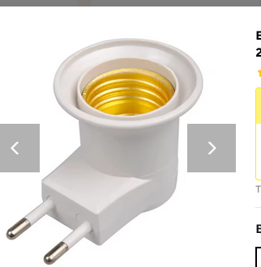

# Shaboref

Shaboref monitors Pikud HaOref (Israel Home Front Command) alerts for a configured city and drives a smart bulb to change colour based on the current alert state. You can only run this from within Israel, obviously.

## Why

We wanted a purely passive Shabbat-friendly alert indicator — no interaction, no screens, just a glanceable light. Shaboref polls Pikud HaOref and changes a smart bulb's colour to reflect the current state:

| Colour | Meaning |
|--------|---------|
| 🔴 Red | Rockets |
| 🟡 Yellow | Early warning |
| 🟢 Green | Leave the mamad (all clear) |
| 🟠 Orange | No internet (request failed) |
| ⚪ White | Unknown / no data |

## Hardware

Pieces I bought:

### Bulb Holder



[Buy here](TODO)

### Smart Bulb


[Buy here](TODO)

## Configuration

| Option | CLI flag | Env var | Default | Required |
|--------|----------|---------|---------|----------|
| City / zone | `--city` | `PIKUD_HAOREF_ZONE` | — | yes |
| Poll interval (seconds) | `--delay` | `CHECK_HOMEFRONT_DELAY` | 60 | no |

CLI flags override environment variables.

## Running with Docker Compose

1. Clone the repository:

```sh
git clone <repo-url> && cd shaboref
```

2. Set your city, API polling delay (in seconds), build, and run

```sh
export PIKUD_HAOREF_ZONE="נתניה - מזרח"
export POLLING_SECONDS=90
docker compose up --build -d --force-recreate --remove-orphans
```

## Stopping

```sh
docker compose down
```
